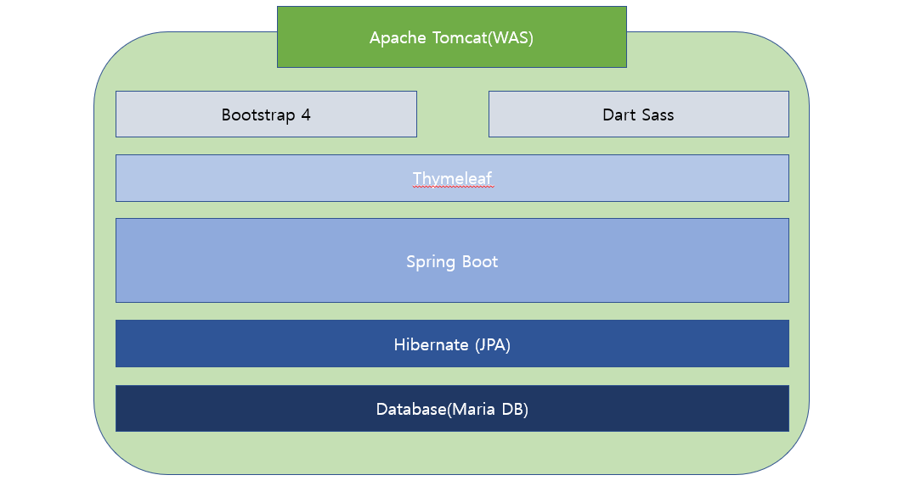
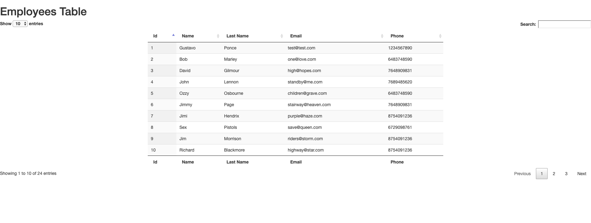
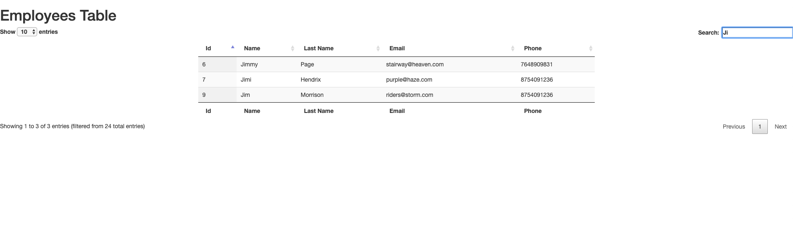

# FullstackEmployee 
yet processing...

## Basic Info ##

* Apache Tomcat(WAS)
* Bootstrap 4 
* Dart Sass
* Thymeleaf
* Javascript/Ajax/Jquery
* Spring Boot (Project Type: Maven Project)
* JAVA 8 or higher
* Hibernate/JPA
* MySQL/MariaDB

# Technical Architecture

### Database Migration [Flyway](https://flywaydb.org/)

# TroubleShooting
* Database Name
* Database User(authorized)
* Database password
* hibernateDialect
* TimeZone
* SQL name

# Screenshot
## Entire UI

## Search engine

# API Documentation
[Click here](API.md) for API documentation

## License 
The MIT License
 
MIT © [ChoHyoungSeo](https://github.com/ChoHyoungSeo/)
